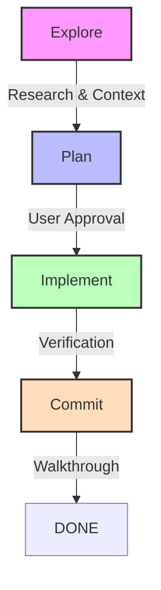
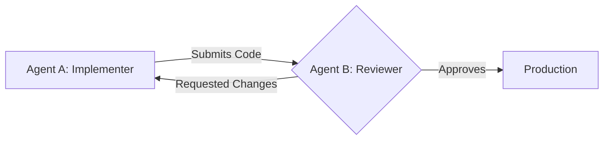

/* ============================================================
 * कुटुंबली — KUTUMBLY SOVEREIGN OS
 * Zero Cloud · Local First · Encrypted · Offline Forever
 * ============================================================
 * System Architect   :  Jawahar R. M.
 * Organisation:  AITDL Network — Sovereign Division
 * Project     :  Kutumbly — India's Family OS
 * Contact     :  kutumbly@outlook.com
 * Web         :  kutumbly.com | aitdl.com | aitdl.in
 *
 * © 2026 Kutumbly.com — All Rights Reserved
 * Unauthorized use or distribution is prohibited.
 *
 * "Memory, Not Code."
 * ============================================================ */

# 🛡️ AI Agent Coding Guidelines: The Sovereign Standard

This document defines the mandatory protocol for AI Agents and Human Engineers operating within the Kutumbly ecosystem. To maintain the integrity of our **Zero Cloud, Local-First** promise, every task must adhere to this high-fidelity workflow.

---

## 🛰️ 1. The 4-Phase Workflow
Every task, regardless of size, must follow the sequence of **Explore → Plan → Implement → Commit**. Skipping phases leads to technical debt and architectural drift.

| Phase | Description | Key Artifacts |
| :--- | :--- | :--- |
| **Explore** | Thoroughly research the codebase, read relevant KIs, and understand dependencies. | Research Notes |
| **Plan** | Define the technical approach, file changes, and potential risks. | `implementation_plan.md` |
| **Implement** | Execute the plan in atomic steps, tracking progress. | `task.md`, Code Edits |
| **Commit** | Verify code correctness, run tests, and document the changes. | `walkthrough.md`, Tests |

---

## 🪟 2. The #1 Constraint: The Context Window
LLM performance is inversely proportional to context saturation. As the context window fills, the agent's "reasoning" degrades, leading to hallucinations or forgotten instructions.

> [!CAUTION]
> **Context Exhaustion Warning**: 
> - If you feel the agent is becoming repetitive or ignoring rules, **START A FRESH SESSION**.
> - Do not bundle unrelated tasks into a single session.
> - High-fidelity tasks require "fresh" attention.

---

## 🧪 3. Verification is Non-Negotiable
An unverified change is a failed change. AI-generated code must be proven to work through active validation.

### Verification Matrix
- **Unit Tests**: Ensure logic is sound (e.g., encryption, SQL queries).
- **UI Validation**: Use the `browser_subagent` to capture screenshots and compare them against the **Reference UI** (`kutumbly-ui.html`).
- **Build Integrity**: Always run `npm run build` or equivalent to check for TypeScript/Linting errors.

> [!IMPORTANT]
> If a task lacks clear success criteria, the agent MUST ask for them before moving from **Explore** to **Plan**.

---

## ✍️ 4. Prompting Quality & Context
Garbage In, Garbage Out. To maximize agent efficiency, provide high-density context.

- **Provide Examples**: Include input/output snippets for new features.
- **Refer to Protocols**: Explicitly mention `AGENTS.md` and `AI_GUIDELINES.md` in prompts to keep the agent "locked" in the Sovereign mindset.
- **Terminology**: Always use `.kutumb` when discussing data persistence.

---

## 🤖 5. Subagents and Parallelism
Leverage multiple agent sessions to ensure quality through diversity.

### The Writer/Reviewer Pattern
One agent writes the implementation, while a separate agent (with a fresh context) performs the Code Review. This prevents self-bias and catches subtle bugs.

---

## 👥 6. Human Review & Maintainability
AI is a partner, not a replacement. Treat AI-generated code with the same scrutiny as human-written code.

- **Maintainability**: Ensure code follows the established hooks and component structure (e.g., `<ModuleShell>`, `useVault`).
- **PR Reviews**: Every AI change must be human-reviewed for long-term health.
- **Sovereignty**: Ensure no external dependencies (Firebase, Supabase, etc.) were snuck into the codebase.

---

> [!TIP]
> **"Memory, Not Code."** - Every bit of code we write is a liability. Only write what is essential to preserve the user's memory and privacy.
