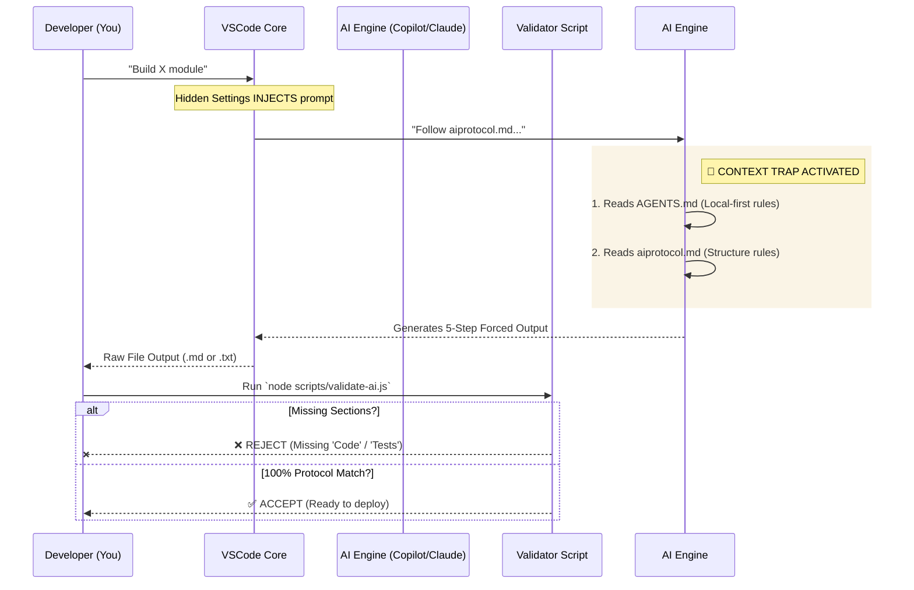

# 🧠 Kutumbly AI Architecture & Enforced Workflow

This document explains the complete pipeline of how an AI Agent inside the Kutumbly environment is forced to behave, process inputs, and output perfectly structured code without ever needing a custom LLM API.

## Workflow Visualization

---

## The 4 Rigid Phases of Operation

### 🛠️ 1. The Trigger Phase (Hidden Co-Pilot Trap)
When you type a simple command like *"Fix the tasks UI"* inside your editor, your AI doesn't just see those 4 words. Because of `.vscode/settings.json`, it actually sees:
> `Follow aiprotocol.md strictly. Do not skip any rule. Fix the tasks UI`

### 📚 2. The Context Assembly Phase (The Brainwash)
Before generating code, the AI looks up the mentioned files. 
- **`AGENTS.md` says:** "You are in Kutumbly OS. You cannot use external APIs or Firebase. You must use `sql.js` locally. Always write the exact file signature on top." 
- **`aiprotocol.md` says:** "Never just give me the code. I need you to prove you thought about it. Output exactly these 5 headings: Understanding, Plan, Code, Test Cases, Notes."

### ⚙️ 3. The Computation Phase (LLM Execution)
The AI is now mentally "locked" in the Kutumbly system. Even if it wants to use `localStorage` or `MongoDB` (based on its generic training), the `AGENTS.md` warning scares it from deviating, forcing it to write pure Zero-Cloud SQLite WASM code.

### 🛡️ 4. The Quality Gate Phase (Validation)
Once the output is generated, you pipe it into `node scripts/validate-ai.js`. 
1. Did the AI get lazy and skip the tests? **Script throws `exit 1` error.**
2. Did it skip explaining its understanding? **Error.**
If everything is there, you get a clean ✅ signal.

## Why this is extremely powerful?
By engineering the **Environment** rather than the Model, Kutumbly ensures that **no rogue code ever makes it to production**. Every future developer or junior AI agent that touches this repository is automatically forced to produce code of the exact same Enterprise caliber.
